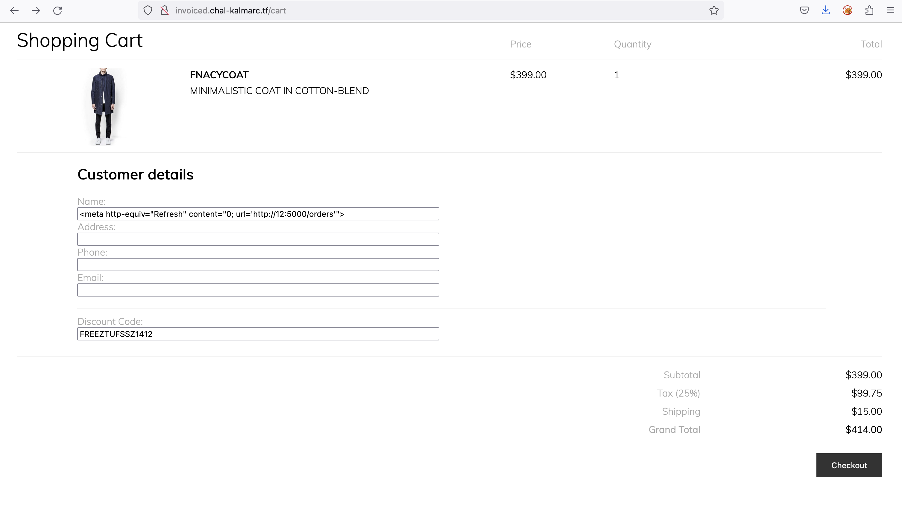
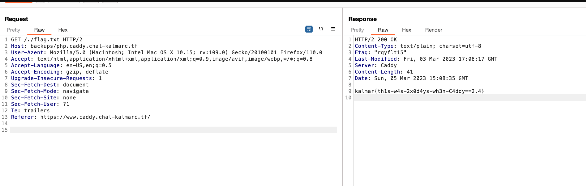

# KalmarCTF 2023
KalmarCTF 2023にソロ参加しました。  
3日間のCTFだったのですが最終日の夜の数時間だけ参加しました。
得点の低い(簡単そうな)Web問を2問解きました。

## Invoiced (100 points)
ショッピングサイトで購入した明細をpdfとして出力してくれるアプリケーション。  
pdfの出力といえば、pdf generatorがHTMLを解釈することで起こるSSRFが有名です。
ソースコードを見るとSSRFをして、フラグを獲得する必要があります。

```js:index.js
app.get('/orders', (req, res) => {
  if (req.socket.remoteAddress != "::ffff:127.0.0.1") {
    return res.send("Nice try")
  }
  if (req.cookies['bot']) {
    return res.send("Nice try")
  }
  res.setHeader('X-Frame-Options', 'none');
  res.send(process.env.FLAG || 'kalmar{test_flag}')
})

app.listen(port, () => {
  console.log(`Example app listening on port ${port}`)
})
```

pdfを生成する`renderPdf`は以下のようになっています。
```js:pdf.js
async function renderPdf(body){
    const browser = await puppeteer.launch(browser_options);
    const page = await browser.newPage();
    const cookie = {
        "name": "bot",
        "value": "true",
        "domain": "localhost:5000",
        "httpOnly": true,
        "sameSite": "Strict"
    }
    await page.setCookie(cookie)
    await page.goto("http://localhost:5000/renderInvoice?"+querystring.stringify(body), { waitUntil: 'networkidle0' });
    await delay(1000)
    const pdf = await page.pdf({ format: 'A4' });
    await browser.close();
    return pdf
}
```

```js:index.js
app.get('/renderInvoice', async (req, res) => {
  if (!invoice) {
    invoice = await readFile('templates/invoice.html', 'utf8')
  }

  let html = invoice
  .replaceAll("{{ name }}", req.query.name)
  .replaceAll("{{ address }}", req.query.address)
  .replaceAll("{{ phone }}", req.query.phone)
  .replaceAll("{{ email }}", req.query.email)
  .replaceAll("{{ discount }}", req.query.discount)
  res.setHeader("Content-Type", "text/html")
  res.setHeader("Content-Security-Policy", "default-src 'unsafe-inline' maxcdn.bootstrapcdn.com; object-src 'none'; script-src 'none'; img-src 'self' dummyimage.com;")
  res.send(html)
})
```

`/renderInvoice`を見ると、任意のHTMLタグを挿入できルのですが、CSPにより色々と制限されています。  
CSPをバイパスできないか色々と試したのですがほとんどが失敗に終わりました。

- `<script>`タグの挿入 -> CSPに弾かれる。
- `<iframe>`タグの挿入 -> CSPに弾かれる。
- `<link>`タグの挿入 -> CSPに弾かれる。
- `<embed>`, `<object>`,... -> CSPに...
- `<iframe srcdoc='<iframe>'>`のように子にiframeを挿入 -> CSPに弾かれる。
  - この入れ子にした場合のブラウザの挙動を把握していなかったので勉強になった。
- ``タグの挿入 -> レンダリングに失敗し、フラグを読めない。
  - `img-src 'self'`なため、うまいことできないか模索するも失敗。srcのデータをテキストで表示できるなオプションを探したが見つからなかった。
- `<meta>`タグによってCSPを書き換えれないか ->  仕様を見るとどちらも適用されるだけだった。

色々調べ回っていると、`<meta>`タグの`content`属性を用いたリダイレクを見つけました。

`<meta>`タグを利用して、フラグの場所にリダイレクトすれば読めそうです。   
Cookieに`bot`が入っていると弾かれるため、`localhost`の代わりに`127.0.0.1`を利用しました。 SameSiteがStrictなため、`localhost`に付与されても`127.0.0.1`には付与されません。  

よって、最終的なペイロードは、`<meta http-equiv="Refresh" content="0; url='http://127.0.0.1:5000/orders'"/>`



flag: `kalmar{fr33_r34l_3st4t3_c91ad`

---

## Ez⛳ (100 points)

非公開ディレクトリという想定のbackupsディレクトリ内のflag.txtを読む問題。

```
{
    admin off
    local_certs  # Let's not spam Let's Encrypt
}

caddy.chal-kalmarc.tf {
    redir https://www.caddy.chal-kalmarc.tf
}

#php.caddy.chal-kalmarc.tf {
#    php_fastcgi localhost:9000
#}

flag.caddy.chal-kalmarc.tf {
    respond 418
}

*.caddy.chal-kalmarc.tf {
    encode zstd gzip
    log {
        output stderr
        level DEBUG
    }

    # block accidental exposure of flags:
    respond /flag.txt 403

    tls /etc/ssl/certs/caddy.pem /etc/ssl/private/caddy.key {
        on_demand
    }

    file_server {
        root /srv/{host}/
    }
}
```
フォルダ構成
```zsh
⛳-server ➤ tree .                                                                                                                                                                                                     
├── docker-compose.yaml
└── files
    ├── Caddyfile
    ├── backups
    │   ├── php.caddy.chal-kalmarc.tf
    │   │   ├── flag.txt
    │   │   └── index.php
    │   ├── static.caddy.chal-kalmarc.tf
    │   │   └── logo_round.svg
    │   └── www.caddy.chal-kalmarc.tf
    │       └── index.html
    ├── php.caddy.chal-kalmarc.tf
    │   └── index.php
    ├── static.caddy.chal-kalmarc.tf
    │   └── logo_round.svg
    └── www.caddy.chal-kalmarc.tf
        └── index.html

9 directories, 9 files
```
 
ドキュメントを読んでいると、`tls`の`on_demand`オプションがセキュアじゃない！みたいなこと書いてあった。
よくわからんかったのでgithubのIssueからそれっぽいのを探すと以下を発見。(関係ないかも)
https://github.com/caddyserver/caddy/issues/2092

改めてCaddyfileを読むと次のようになっていることから、Hostヘッダを上手いこと細工すればbackupsフォルダにアクセスできるかもと推測。

```
file_server {
    root /srv/{host}/
}
```

また直接読むと403で弾かれるため、`/./flag.txt`を読むことにしました。
```
# block accidental exposure of flags:
respond /flag.txt 403
```



flag: `kalmar{th1s-w4s-2x0d4ys-wh3n-C4ddy==2.4}`

---

## 所感
普通に難しかった。
今年からはCTFにもっと参加したい。
