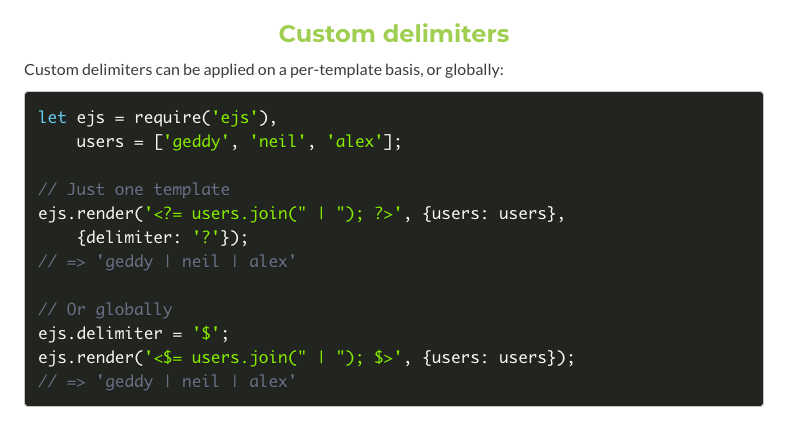

hxpCTF 2022にソロ参加しました。  
3日間のCTFでがっつり時間を使って戦いましたが一問しか解けず1256チーム中121位でした。  
解けた問題のWriteupです。

## Valentine (113 solve)
バレンタインのカードのテンプレートをユーザの入力から作成可能なWebアプリ。  
テンプレートエンジンはejsで、埋め込むことのできるテンプレートは `<$= name $>` のみに制限されていました。

```js
// テンプレート登録箇所
app.post('/template', function(req, res) {
  let tmpl = req.body.tmpl;
  let i = -1;
  while((i = tmpl.indexOf("<%", i+1)) >= 0) {
    if (tmpl.substring(i, i+11) !== "<%= name %>") {
      res.status(400).send({message:"Only '<%= name %>' is allowed."});
      return;
    }
  }
  ...
});
```

```js
// テンプレート表示箇所
app.get('/:template', function(req, res) {
  let query = req.query;
  let template = req.params.template
  if (!/^[0-9A-F]{8}-[0-9A-F]{4}-[4][0-9A-F]{3}-[89AB][0-9A-F]{3}-[0-9A-F]{12}$/i.test(template)) {
    res.status(400).send("Not a valid card id")
    return;
  }
  if (!fs.existsSync(`views/${template}.ejs`)) {
    res.status(400).send('Valentine\'s card does not exist')
    return;
  }
  if (!query['name']) {
    query['name'] = ''
  }
  return res.render(template, query);
});
```

フラグを獲得するまでに試した主なことは以下です。
- シンプルに `<%` をバイパスする。
  - [JavaScriptにおけるUnicodeの扱いが複雑な件](https://mathiasbynens.be/notes/javascript-unicode)みたいな話があるのでUnicode表記とか、サロゲートペアとかその辺をいじいじして抜けないか試しましたが、失敗しました。
- custom delimitersを利用する。 
  - デフォルトでは、 `<$ $>` を利用するのですが、ドキュメントを読むとデリミタを変更できるようでした(下の画像)。prototype pollutionを使って、 `ejs.delimiter` を設定できないか考えたのですが、ぱっと見で無さそうだったので諦めました。
    
- HTTP parameter pollution → 特に面白いことできず失敗。
- ディレクトリトラバーサル　→ 厳格なチェックがあるためバイパス失敗。 　
- public exploit 
  - [CVE-2022-29078](https://eslam.io/posts/ejs-server-side-template-injection-rce/)

CVE-2022-29078の記事を見ていると `delimiter` をユーザ入力から変更していました。  
この脆弱性はすでに修正されていましたが、[パッチ](https://github.com/mde/ejs/commit/15ee698583c98dadc456639d6245580d17a24baf)を読むと、受け取ったoptionをマージする箇所は修正されていませんでした。  
そのため、この挙動を悪用して、 `delimiter` を変更できそうです。

処理を追ってみると、入力したdelimiterがoptionとしてマージされてました！


よってPoCは以下
```
// template
<$= global.process.mainModule.require('child_process').execSync('/readflag') $>
```


flag: `hxp{W1ll_u_b3_my_V4l3nt1ne?}`

---

## 所感
難しかったです。  
他のweb問は見慣れない形式だったので問題以前のところで詰まってしまいました。場数を増やしていろんな形式の問題に対応できるようになりたいなと思いました。  
あと関係ないですが、JavaScriptの文字コード問題を調べていた過程で、[urlパーサー](https://www.blackhat.com/docs/us-17/thursday/us-17-Tsai-A-New-Era-Of-SSRF-Exploiting-URL-Parser-In-Trending-Programming-Languages.pdf)と文字コードの話や[PHPのLFI](https://bierbaumer.net/security/php-lfi-with-nginx-assistance/)の話を見つけたので検証してみようと思います。
